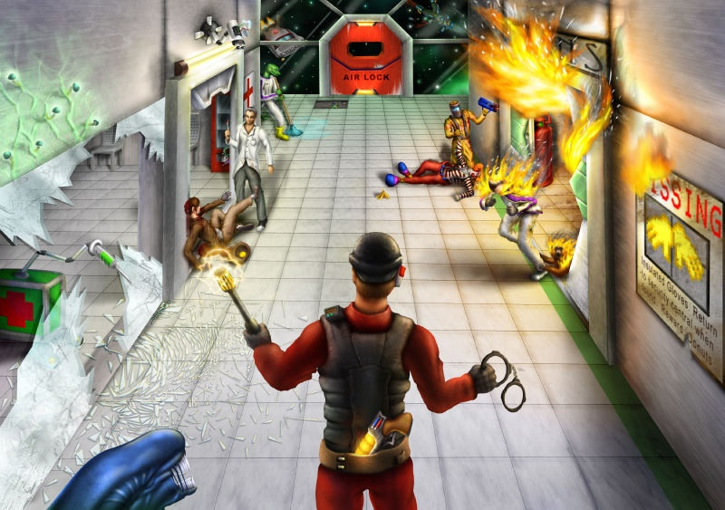

# README

Welcome. This is the .png>)[SS13 Knowledgebase(II)](https://discord.com/invite/ttWKP4GjyS)'s gitbook, founded by BRBDOGONFIRE & Marquis Fury.

Knowledgebase is an open-source project distributed as public domain under Unlicense. Its goal is to aggregate knowledge about the various subjects of Space Station 13 within its various codebases (tgstation, bee, goon, etc.). The organization maintains a [gitbook](https://ss13-knowledgebase.gitbook.io/knowledgebase/) that is sync'd with its repositories.

For more information about contributing see docs/contributing
