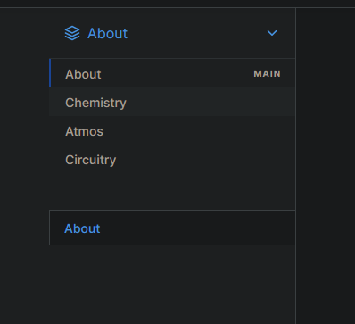

# And How To Output 2MW+

So, you've figured out how to make turbines. Now what?

I will teach you how to turn this:\
.png>)

Into this:\
.png>)

Using only 8 simple steps!\

1. Set up the turbine
2. put a scrubber from the big part to an injector in the small part
3. place down a layer manifold or something to allow input from a canister
4. spam like 10 GPa or whatever you have of gas (MPa range also works)
5. Watch the turbine go to like 800KW (maxed out)
6. Wall off the turbine input
7. ??? (pray to the atmosian gods)
8. Profit
